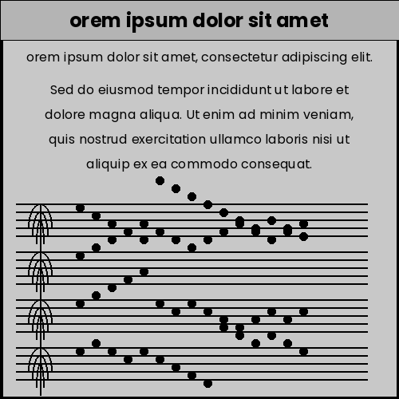
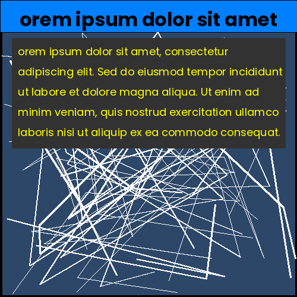
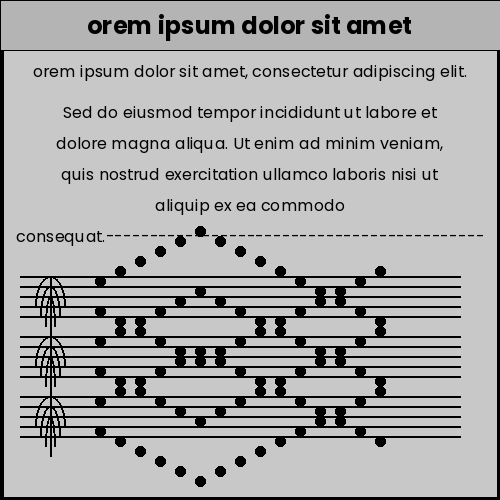

# Card Generator with Tkinter and PIL

## Overview
This project is a **Card Generator** application built using Python. It allows users to create custom cards with different styles, such as **Random**, **Graphs**, **Modern**, **Music Notes**, and **Black**. The application provides a user-friendly interface using **Tkinter** for the GUI and **PIL (Pillow)** for image generation and manipulation.

---

## Technologies Used

### 1. **Python**
   - The core programming language used for the project.
   - Provides flexibility and a wide range of libraries for GUI development and image processing.

### 2. **Tkinter**
   - A standard Python library for creating graphical user interfaces (GUIs).
   - Used to build the main application window, input fields, and buttons.

### 3. **PIL (Pillow)**
   - A powerful image processing library in Python.
   - Used to generate and manipulate images, including drawing shapes, text, and gradients.

### 4. **Random**
   - A Python module used to generate random values.
   - Applied in the **Random Card** and **Graphs Card** to create dynamic and unique designs.

### 5. **Colorsys**
   - A Python module for color space conversions.
   - Used to generate modern color palettes and gradients for the cards.

---

## Techniques and Features

### 1. **Dynamic Card Generation**
   - Each card type has a unique design:
     - **Random Card**: Randomly generated shapes and patterns.
     - **Graphs Card**: Modern graph-like designs with smooth curves.
     - **Modern Card**: Sleek gradients and shadow effects.
     - **Music Notes Card**: Musical staff and notes for a creative touch.
     - **Black Card**: Minimalist design with a dark theme.

### 2. **Text Wrapping and Formatting**
   - The application automatically wraps and formats text to fit within the card's boundaries.
   - Supports multi-line titles and body text with proper alignment.

### 3. **Dynamic Title Bar**
   - The title bar adjusts its height based on the number of lines in the title.
   - Ensures that the title fits perfectly without overflowing.

### 4. **Modern UI Elements**
   - Custom window buttons (minimize, maximize, close) with a modern design.
   - Gradient backgrounds and shadow effects for a polished look.

### 5. **Image Export**
   - Cards are saved as high-quality PNG images.
   - Users can specify the output file name or use a default naming convention.

---

## Use Cases

### 1. **Personalized Greeting Cards**
   - Create custom greeting cards for birthdays, anniversaries, or special occasions.
   - Add a personal touch with unique designs and messages.

### 2. **Educational Tools**
   - Use the **Music Notes Card** to create educational materials for music students.
   - Generate cards with graphs for teaching data visualization.

### 3. **Social Media Content**
   - Design visually appealing cards for social media posts.
   - Export cards as images to share on platforms like Instagram, Twitter, or Facebook.

### 4. **Prototyping and Design**
   - Quickly prototype card designs for print or digital media.
   - Experiment with different styles and layouts.

---

## How to Use

### Prerequisites
- Python 3.x installed on your system.
- Required libraries: `Pillow` (PIL), `tkinter`.

### Installation
1. Clone the repository:
   ```bash
   git clone https://github.com/your-username/card-generator.git
   cd card-generator
   ```

2. Install the required libraries:
   ```bash
   pip install pillow
   ```

### Running the Application
1. Navigate to the project directory:
   ```bash
   cd card-generator
   ```

2. Run the `main.py` script:
   ```bash
   python3 main.py
   ```

3. Use the application:
   - Select a card type from the dropdown menu.
   - Enter a title and text for the card.
   - Click "Generate Card" to create and save the card as a PNG file.

---

## Example Outputs

### Random Card


### Graphs Card


### Modern Card


### Music Notes Card


### Black Card


---

## Future Enhancements
- Add more card styles and customization options.
- Allow users to upload custom images or logos.
- Implement a drag-and-drop interface for easier design.
- Support for exporting cards in multiple formats (JPEG, PDF).

---

## Contributing
Contributions are welcome! If you'd like to contribute to this project, please follow these steps:
1. Fork the repository.
2. Create a new branch for your feature or bug fix.
3. Submit a pull request with a detailed description of your changes.

---

## License
This project is licensed under the **MIT License**. See the [LICENSE](LICENSE) file for details.

---
